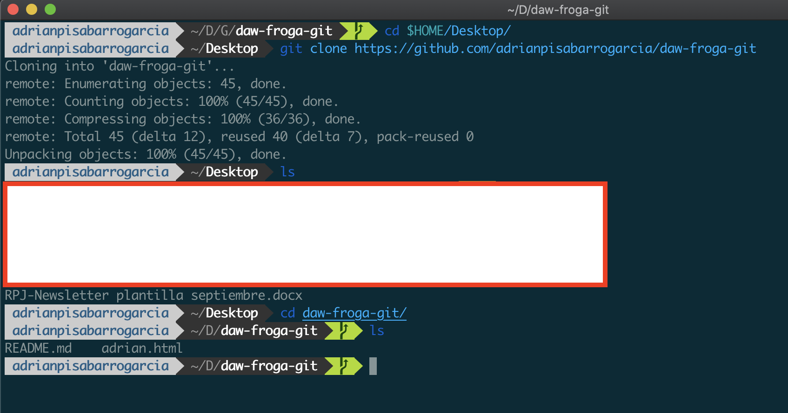

# Trabajo 1 - Introducción a Git
Por: **Adrián Pisabarro García**    
Puedes tener una mejor vista en: [https://github.com/adrianpisabarrogarcia/daw-froga-git/blob/master/git-trabajo/GUION.md](https://github.com/adrianpisabarrogarcia/daw-froga-git/blob/master/git-trabajo/GUION.md)
  
### 1. Iniciar nuestro Repositorio desde local
1.- Lo primero es situarnos en la carpeta donde vamos a crear nuestro repositorio git en mi caso: `$ cd Desktop/Git/`.    
Ahora creamos la carpeta: `$ mkdir daw-froga-git`.    
Y accedemos a ella: `$ cd daw-froga-git/`
   
2.- Utilizamos el comando Git, ahora sí para inicializar nuestro repo en local:
`$ git init`

3.- Vamos a añadir el archivo _README.md_ que nos pide, para eso lo un `$ nano README.md` creamos el archivo Markdown.

4.- Añadimos los archivos a la cola todos los archivos con un `$ git add *`, para comprobar el estado podemos incluso poner un `$ git status`. Ahora un commit para que quede reflejada una versión que subiremos con `$ git commit -m 'add README.md'` y añadimos un mensaje que indique claro y conciso el cambio que hemos hecho. Debemos fijarnos en que hace la inserción.

5.- En estos momentos vamos a sincronizar nuestro repo en local con el repo en GitHub, para ello antes tendremos que crearlo en [GitHub](https://github.com/adrianpisabarrogarcia/daw-froga-git.git) con el mismo nombre previamente y en la terminal añadimos el siguente comando para enlazarlo:  `$ git remote set-url origin https://github.com/adrianpisabarrogarcia/daw-froga-git.git`.   

6.- Ya podemos hacer un *push* para subir todo al repo online: `git push -u origin master` y subirlo a nuestro *origin* en la rama llamada *master*.     

### 2. Crea una rama con otra versión del proyecto
1.- Crear el archivo **adrian.html** y subirlo a la rama master.  
	`$ nano adrian.html` Creación del archivo **adrian.html**.  
	`$ git add *` ó `$ git add adrian.html` Añadir a la cola de subida el archivo **adrian.html**.  
	`$ git commit -m "add file adrian.html to master branch"` Hacer un control de versión.  
	`$ git push origin master` Subir de local a remoto.     
   

2.- Añadimos una rama: `$ git branch test`.   
3.- Movernos a la rama auxiliar: `$ git checkout test`. Saldrá esto:`Switched to branch 'test'`.   
4.- Modifica el archivo **adrian.html** y súbelo a la segunda rama.   
	`$ git nano adrian.html` Hacemos todos los cambios que tenemos que hacer al archivo.   
	`$ git add *` ó `$ git add adrian.html` Añadir a la cola de subida el archivo **adrian.html**.  
	`$ git commit -m "v2 file: adrian.html"` Hacer un control de versión.  
	`$ git push origin master` Subir de local a remoto.     
5.- Comprobación de las dos ramas con los dos archivos diferenciados: 
   

* **¿Cómo veo las ramas que existen?** `$ git branch`.   
* **¿Cómo sé cuál es la rama activa?** Se selecciona con un `* test`.

### 3. Une la rama del ejercicio2 a la rama master.  
1.- Primero nos vamos a situar en la rama destino: `$ git checkout master`.  
2.- Después de añadir cambios vamos a unir las dos ramas, la rama **test** en la **master**: `$ git merge test`.   
3.- Por último se añade un `$ git push` para ver en remoto que he hecho los cambios.   
  

### 4. Volver hacia atrás en los commits
**Opción 1: GIT RESET**       
1.- Primero vamos a localizar el id del cambio con: `$ git log` yo voy a escoger este id: `492233ddcae0faaa063a5b71792b7d991a8113e7` ó `492233d`. Podemos utilizar para no tener tanto texto la opción de `$ git log --oneline | cat`. En este primer paso también podemos hacer uso del `git reset --hard HEAD~n` donde n indica el numero de commit anteriores. Por cierto si inlcuimos el --hard no haría falta hacer un add o un commit, si no lo incluimos sí.    
<pre>
492233d v2 file: adrian.html
6a5765f add file adrian.html to master branch
acff3d5 add README.md
</pre>
2.- Hacemos un reset del commit específico: `$ git reset 492233ddcae0faaa063a5b71792b7d991a8113e7` en este momento nuestro cambio estará en el stage, habrá que hacer un add, un commit, un merge y posteriormente un push por no haber añadido el *--hard*.

**Opción 2: GIT CHECKOUT**  
1.- `$ git log` para saber cual va a ser nuestro id en este caso será: `b691cfe951644e2d88c651038dcea29c188075bb`.  
2.- Ahora nos situaremos en la rama que estara nuestro puntero HEAD: `$ git checkout b691cfe951644e2d88c651038dcea29c188075bb .`.   
3.- En estos momentos nuestro repo ya habrá sufrifo los cambios al haber puesto el punto, faltaría subir los cambios. 

**Opción 3: GIT REVERT**     
Parecido al `$ git reset` pero compara archivos como si hiciera un `$ git diff archivo1 archivo2`.  

**¿Qué diferencia hay?**   
   
* Cuando utilizamos el `$ git reset --hard HEAD~n` lo que hace es identificar cual es el el commit n numeros atrás y añadimos una nueva rama que la tendremos que poner en nuestra rama final. Mueves un puntero llamado *HEAD* a un momento específico.    	
* Cuando utilizamos el `$ git checkout id-log .` directamente identificamos y marcamos a que versión se va a revertir.

### 5. Crear una subrama
Vamos a imitar esta imagen solo que cambiando la llamada "Experimental" por "test" y "otra rama" por "sub-test":       

Creamos las dos ramas gracias a `$ git branch test` y `$ git branch sub-test` para hacer "sub-test" hay que colocarse en "test". Además voy a editar el archivo *adrian.html* en "test" y también en "sub-test" para unirlos.   
<pre>
$ git branch test
$ git checkout test
$ nano adrian.html (-)    
$ git branch sub-test
$ git checkout sub-test
$ nano adrian.html (-)     
$ git checkout test
$ git merge sub-test   
$ git checkout master
$ git merge test (-)
</pre>
(-) con sus correspondientes add y commit.    

### 6. Importar proyecto a escritorio
1.- Nos situamos en el escritorio con la terminal: `$ cd $HOME/Desktop`.   
2.- Hacemos un *clone* con el enlace de GitHub: `$ git clone https://github.com/adrianpisabarrogarcia`.   
3.- Accedemos con un `$ cd <nombre-carpeta>`.    

### 7.- Añade de colaborador y que edite la otra persona
1.-  Me he creado otra cuenta de GitHub con otro correo electrónico.      
2.- Desde mi cuenta habitual lo que he hecho ha sido ir *settings* y después a *Manage access*.   
3.- El otro usuario llamado *pisiadriantxu* ha hecho un cambio en el README.md y lo ha commiteado.    

Imagen 1:    
 
Imagen 2:      
 

 

	 

